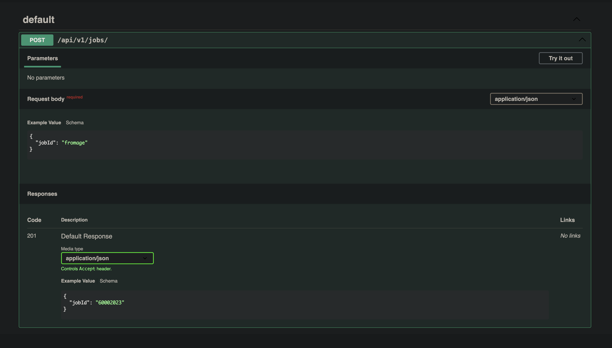
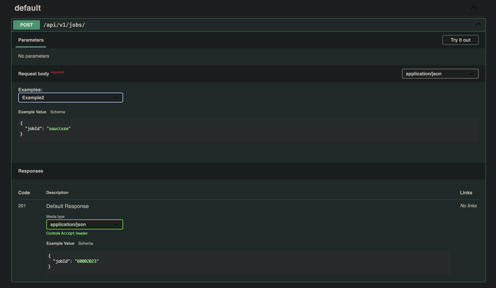

# repro-zod-openapi-swagger-examples

## Commands

```bash
bun install
bun dev
```

# Issue

We encountered an issue with `fastify-zod-openapi` when migrating to `zod` v4. With `zod` v3, we defined our body schema like so:

```ts
export const postJobsBodySchema = z
  .object({
    jobId: z.string(),
  })
  .openapi({
    examples: [{ jobId: '123' }, { jobId: '456' }],
  })
```

which resulted in a schema looking like this:

```json
"requestBody": {
  "content": {
    "application/json": {
      "schema": {
        "type": "object",
        "properties": {
          "jobId": {
            "type": "string"
          }
        },
        "required": [
          "jobId"
        ]
      },
      "examples": {
        "example1": {
          "value": { "jobId": "123" }
        },
        "example2": {
          "value": { "jobId": "456" }
        }
      }
    }
  },
  "required": true
},
```

With `fastify-zod-openapi@5.3.2` and the switch to `zod` v4, doing something like this:

```ts
export const postJobsBodySchema = z
  .object({
    jobId: z.string(),
  })
  .meta({
    examples: [{ jobId: '123' }, { jobId: '456' }],
  });
```

results in the following schema:

```json
"requestBody": {
  "content": {
    "application/json": {
      "schema": {
        "examples": [
          { "jobId": "123" },
          { "jobId": "456" }
        ],
        "type": "object",
        "properties": {
          "jobId": {
            "type": "string"
          }
        },
        "required": [
          "jobId"
        ]
      },
    }
  },
  "required": true
},
```

As you can see, `examples` prop is in `schema` prop and has an invalid shape which causes examples to no longer appear in swagger (only first example is displayed as default).



I was able to hack something by modifying `src/transformer.ts` in `fastify-zod-openapi`, which resolves the missing examples on swagger-ui:



Could you take a look and tell me if this is the right course of action?

Thanks!
